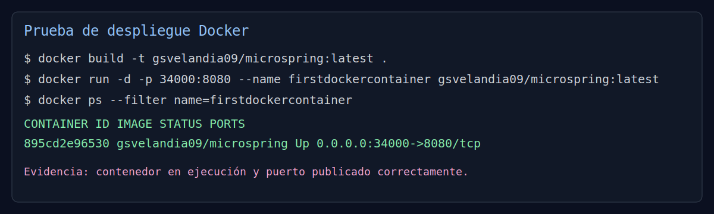
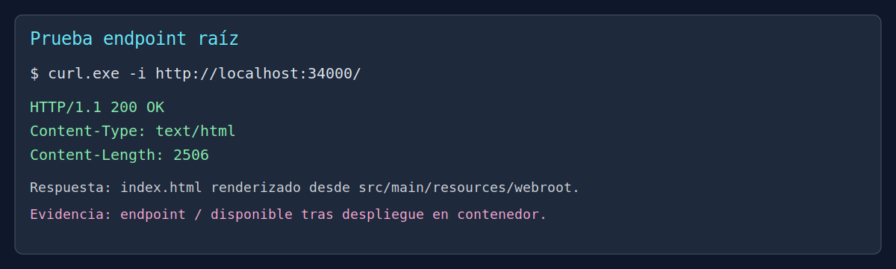
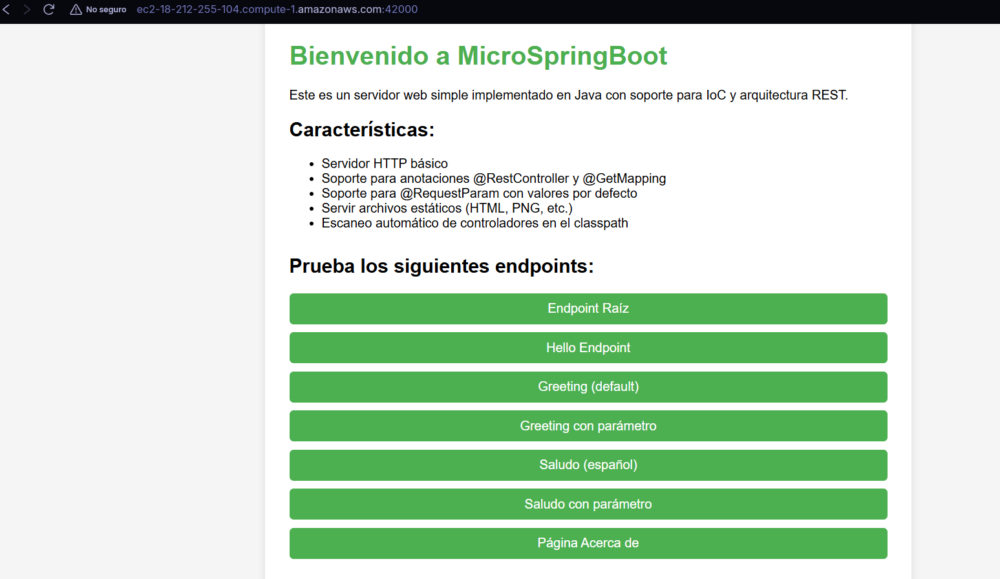

# MicroSpringBoot

MicroSpringBoot es un micro-framework web en Java que implementa un servidor HTTP con IoC por anotaciones. Permite registrar controladores con `@RestController`, mapear rutas con `@GetMapping`, recibir parámetros con `@RequestParam` y servir archivos estáticos desde `webroot`.

## 1. Resumen del Proyecto

### Objetivo
Construir un servidor web ligero tipo Spring Boot, pero desde cero, aplicando reflexión, inyección por convención y enrutamiento dinámico.

### Alcance implementado
- Resolución de rutas dinámicas (`GET`) por anotaciones.
- Servicio de archivos estáticos (`html`, `css`, `js`, imágenes).
- Soporte concurrente para múltiples clientes con pool de hilos.
- Apagado elegante (`graceful shutdown`) del servidor.
- Contenerización con Docker y despliegue con Docker Compose.

### Tecnologías
- Java 17
- Maven
- Docker / Docker Compose
- Reflection API de Java

## 2. Arquitectura

El proyecto sigue una arquitectura por capas ligeras:

1. **Capa de transporte HTTP**
   - `ServerSocket` acepta conexiones TCP.
   - Cada conexión se procesa en un `ExecutorService`.

2. **Capa de enrutamiento**
   - El framework mantiene un mapa `path -> ControllerMethod`.
   - Si la ruta existe, invoca el método del controlador por reflexión.
   - Si no existe, intenta resolver archivo estático en `src/main/resources/webroot`.

3. **Capa IoC / reflexión**
   - Escanea controladores registrados.
   - Crea instancias y registra métodos anotados con `@GetMapping`.
   - Resuelve parámetros con `@RequestParam` y valores por defecto.

4. **Capa de respuesta HTTP**
   - Construye respuestas HTTP 1.1 con `Content-Type` y `Content-Length`.
   - Soporta códigos de error (`404`, `403`, `500`).

## 3. Diseño de Clases

| Clase | Rol | Responsabilidades |
|------|-----|-------------------|
| `MicrosSpringBoot` | Núcleo del framework | Levantar servidor, aceptar conexiones, enrutamiento, estáticos, apagado elegante |
| `MicrosSpringBoot.ControllerMethod` | DTO interno | Asociar instancia de controlador con método Java |
| `RestController` | Anotación | Marcar clases como controladores gestionados por el framework |
| `GetMapping` | Anotación | Asociar método con una ruta `GET` |
| `RequestParam` | Anotación | Vincular parámetros de query string con argumentos de método |
| `HelloController` | Controlador ejemplo | Endpoints básicos `/` y `/hello` |
| `GreetingController` | Controlador ejemplo | Endpoints con parámetros (`/greeting`, `/saludo`) |

## 4. Flujo de Solicitud

1. Cliente envía `GET /ruta`.
2. `MicrosSpringBoot` recibe socket y despacha a un hilo del pool.
3. Se parsea request line y query string.
4. Si hay controlador para la ruta, se invoca por reflexión.
5. Si no hay controlador, se intenta archivo estático.
6. Se retorna respuesta HTTP con cabeceras correctas.

## 5. Ejecución Local

```bash
mvn clean package
java -cp target/classes escuelaing.edu.arep.microspringboot.MicrosSpringBoot
```

Probar en navegador: `http://localhost:8080`

## 6. Generación de Imágenes Docker y Despliegue

### 6.1 Construir imagen local

```bash
mvn exec:java -Dexec.mainClass="escuelaing.edu.arep.microspringboot.MicrosSpringBoot"
```

### 6.2 Ejecutar contenedor

```bash
docker run -d -p 34000:8080 --name firstdockercontainer microspring:latest
```

### 6.3 Publicar imagen en Docker Hub

```bash
docker tag microspring:latest gsvelandia09/microspring:latest
docker push gsvelandia09/microspring:latest
```

### 6.4 Desplegar con Docker Compose

```bash
docker compose up --build -d
```

Servicios esperados:
- `web`: aplicación MicroSpringBoot
- `db`: MongoDB

## 7. Evidencias de Despliegue (Pruebas)

### Evidencia 1: Contenedor arriba con puerto publicado



### Evidencia 2: Respuesta HTTP exitosa del endpoint raíz



### Evidencia 3: Vista en navegador de la app desplegada



Link video:
https://youtu.be/R4yyLMkd4aw

## 8. Endpoints de ejemplo

- `GET /`
- `GET /hello`
- `GET /greeting`
- `GET /greeting?name=Juan`
- `GET /saludo`
- `GET /about.html`

## 9. Notas Técnicas

- El framework actual soporta únicamente `GET`.
- No hay sesiones ni plantillas del lado servidor.
- El parser HTTP es simple y orientado a fines académicos.

## 10. Autor

Proyecto académico para TDSE.

